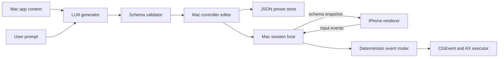

# Universal Controller MVP Architecture

Universal Controller is a controller system for Mac and iPhone. The Mac understands the user's current task, AI designs a controller from a fixed catalog of controls, and the iPhone renders that controller and streams deterministic input events back to the Mac.

## Product flow

1. The user opens an app such as Keynote or Google Slides.
2. They click the Universal Controller tile in the Mac menu bar.
3. Universal Controller captures the previous app and window title, then opens a centered, Spotlight-style overlay.
4. The user describes the controller they need.
5. AI selects built-in controls, lays them out, and maps them to allowed Mac actions.
6. The user previews and manually adjusts the layout, labels, styles, and mappings.
7. The Mac displays a pairing QR code.
8. The iPhone scans it, connects locally, and renders the controller.
9. Phone input travels directly to the Mac and triggers keyboard, mouse, scroll, or Accessibility actions.
10. The controller can be saved and reused as a preset.

AI is used only to design the controller. It is never part of the real-time input path.

## Architecture

The Mac is the host and source of truth. It owns context capture, AI generation, validation, editing, presets, pairing, and action execution. The iPhone is a schema-driven renderer and input source.



Universal Controller ships a versioned catalog of native components and visual assets. AI selects and configures catalog entries; it does not generate SwiftUI code or arbitrary images. Manual edits update the same schema produced by AI.

## Technology choices

- Native Swift and SwiftUI for both apps, with focused AppKit/UIKit bridges.
- AppKit `NSStatusItem` for the menu-bar tile.
- A borderless floating `NSPanel` hosting SwiftUI for the centered Mac overlay.
- `LSUIElement` so the Mac app has no normal Dock icon or permanent window.
- A local Swift package with `UniversalControllerCore` and `UniversalControllerTransport` libraries.
- Network.framework using `NWListener`, `NWBrowser`, and `NWConnection`.
- TCP and Bonjour for the MVP, with continuous events coalesced to avoid backlogs.
- Core Image for QR generation and VisionKit for QR scanning.
- Core Motion for attitude, rotation, accelerometer, and gyroscope input.
- Core Graphics `CGEvent` for keyboard, mouse, and scroll actions.
- ApplicationServices `AXUIElement` for later Accessibility actions.
- `URLSession` for the first LLM provider implementation.
- Keychain for the LLM API key and `OSLog` for diagnostics.
- Atomically written JSON files for presets.

Do not start with MultipeerConnectivity because Xcode 27 deprecates the framework. Keep transport behind an interface so QUIC can replace TCP later if profiling shows a need.

## Mac overlay and context

Clicking the menu-bar tile toggles a centered, Spotlight-style overlay containing:

- The controller prompt
- Captured app/window context
- Generated controller preview
- Basic controller editor
- Pairing QR code
- Saved presets
- Connection and permission status

`AppContextMonitor` observes app activation, ignores Universal Controller itself, and remembers the last external frontmost app and focused-window title before opening the overlay. The overlay closes with Escape, an outside click, or another menu-bar click.

For Google Slides, the executable target is Safari or Chrome while the browser window title supplies the Slides context. The MVP will not require a browser extension or inspect private browser state. When the overlay closes, or before the first keyboard action, Universal Controller reactivates the captured app so shortcuts reach the intended target.

## Controller schema

`ControllerDocument` is the common contract for AI output, manual editing, presets, networking, and iPhone rendering.

```json
{
  "schemaVersion": 1,
  "id": "controller-uuid",
  "revision": 1,
  "name": "Keynote Presenter",
  "target": {
    "bundleID": "captured-by-mac",
    "displayName": "Keynote"
  },
  "layout": {
    "pages": [{
      "id": "main",
      "title": "Present",
      "columns": 2,
      "items": [{
        "controlID": "next",
        "columnSpan": 1,
        "rowSpan": 1
      }]
    }]
  },
  "controls": [{
    "id": "next",
    "type": "button",
    "label": "Next",
    "variant": "primary",
    "config": {}
  }],
  "bindings": [{
    "controlID": "next",
    "event": "triggered",
    "action": {
      "type": "keyChord",
      "key": "rightArrow",
      "modifiers": []
    }
  }]
}
```

The v1 schema uses closed, tagged types:

- Controls: `button`, `slider`, `joystick`, `trackpad`, `gesturePad`, and `motion`.
- Motion sources: `attitude`, `rotationRate`, `gravity`, `userAcceleration`, `accelerometer`, and `gyroscope`.
- Event values: `none`, `scalar`, `vector2`, `vector3`, and a closed gesture enum.
- Actions: `keyChord`, `mouseMove`, `mouseButton`, `scroll`, and later `accessibilityAction`.
- Continuous transforms: explicit axis, gain, inversion, dead-zone, and clamp fields.
- Layout: pages containing a small responsive grid.

The validator enforces versions, unique IDs, valid references, sane ranges, known assets, compatible control/action types, allowed keys and modifiers, maximum control counts, and the captured target app. Unknown fields and actions fail closed. The Mac assigns trusted metadata such as document ID, target, and revision.

## Control catalog and manual editor

`ControlCatalog` defines every component available to both AI and the user:

- Control kind and visual variants/assets
- Editable properties
- Events emitted by the control
- Actions compatible with those events
- Default size and configuration

The basic Mac editor has:

- A grid preview for selecting, reordering, and resizing generated controls.
- An inspector for labels, variants, control settings, and mappings chosen from safe menus.

Edits operate on a draft and commit as one undoable schema revision. A committed revision is validated, saved if requested, and pushed live to the paired iPhone. The MVP editor adjusts AI-generated or saved controls; a complete palette-based builder is deferred.

## Pairing and networking

The Mac starts a TCP listener, advertises `_universalctrl._tcp` through Bonjour, and opts into peer-to-peer networking. The Bonjour TXT record contains only the protocol version and a nonsecret session UUID.

The QR contains:

- Protocol version
- Session UUID
- A random 256-bit, one-time pairing secret
- Expiration time
- An optional LAN host/port fallback

The phone scans the QR, locates the matching Bonjour service, and opens a connection. A fresh server challenge and CryptoKit HMAC prove that the phone possesses the QR secret without transmitting it. The Mac accepts one phone, expires the secret, and stops advertising after pairing.

Messages use size-limited, 4-byte length-prefixed JSON:

- `clientHello`, `serverChallenge`, `pairingProof`, `paired`
- `schemaSnapshot`, `schemaUpdate`
- `controlEvent`
- `ping`, `pong`, `error`

Schemas and discrete actions use ordinary reliable sends. Motion and trackpad input retain only the latest unsent value, send at most 30 times per second, and include sequence numbers so stale events can be dropped. A newer schema revision atomically replaces the iPhone UI.

The authenticated TCP design is acceptable for the local hackathon demo but is not transport-confidential. A production version should derive a session key and seal frames or use pinned TLS/QUIC.

## Mac action execution

Universal Controller requests Accessibility trust early with `AXIsProcessTrustedWithOptions`. The demo Mac app runs locally signed and outside the App Sandbox.

The first action executor supports:

- Semantic keyboard shortcuts
- Relative mouse movement
- Mouse clicks
- Pixel or line scrolling

Before a keyboard action, Universal Controller verifies and, if necessary, reactivates the captured target app. It then posts the action through `CGEvent`.

Accessibility-tree actions come later. They will use bounded selectors within the focused window and invoke `AXUIElementPerformAction` or set an allowed value. AI-generated shell commands, AppleScript, executable code, and unbounded Accessibility traversal are not allowed.

## AI structured output

Define a small `ControllerGenerating` protocol and implement one provider first, using the OpenAI Responses API with strict JSON Schema over `URLSession`.

The request includes:

- Captured app name, bundle ID, and window title
- The user's prompt
- The exact control and action catalog
- Concise examples
- A strict JSON Schema with unknown properties disabled

The model generates the editable controller body. The Mac injects trusted IDs, version, revision, and target metadata; decodes and semantically validates the result; and shows a human-readable action preview before enabling it. Retry once on semantic failure.

Keep a bundled Keynote preset as an explicitly labeled fallback for provider or network failure. Never present the fallback as generated output.

## MVP scope

Build one polished presentation-controller story:

- Menu-bar tile and centered overlay with no Dock window
- Captured target app and window context
- Prompt-to-controller generation
- Controller preview and basic manual editing
- QR pairing with one physical iPhone
- Dynamic iPhone rendering
- Previous, next, blackout, and tilt-to-pointer controls
- Live schema updates
- Save, list, load, rename, and delete JSON presets
- Clear permission, generation, target, and connection states

Keynote is the first reliable demo. Once stable, verify the same flow in Google Slides by capturing the browser and window title and mapping to normal presentation shortcuts.

Defer:

- Multiple phones
- Accounts, cloud sync, and controller sharing
- Browser extensions or deep tab inspection
- A full palette-based controller builder
- Arbitrary macros and scripts
- Complex Accessibility authoring
- Background phone operation
- Blender and video-editor polish
- QUIC or UDP optimization

## Smallest vertical slice

Acceptance test:

> With Keynote open, click Universal Controller, prompt “Give me one Next Slide button,” generate a valid one-button schema, scan the QR with an iPhone, see the button appear, tap it, and advance the slide. No model call occurs after generation.

Implementation order:

1. Create the menu-bar-only Mac shell, centered overlay, iPhone target, and shared models for `button`, `keyChord`, `schemaSnapshot`, and `controlEvent`.
2. Add context capture, Accessibility onboarding, focus restoration, and a local Mac button that posts Right Arrow to Keynote.
3. Add the Mac listener, Bonjour advertisement, QR descriptor, phone scanner/browser/client, framed connection, and pairing handshake.
4. Send a hardcoded one-button schema, render it on iPhone, and route its press to the Mac executor.
5. Replace the hardcoded schema with strict, validated LLM output. This completes the first vertical slice.
6. Add the basic grid/inspector editor, undoable commits, revisioning, and live updates.
7. Add JSON preset persistence.
8. Add control variants, motion input, pointer transforms, dead-zone/smoothing, and then slider/trackpad if time remains.
9. Polish diagnostics, permissions, empty/error states, the fallback preset, and physical-device testing.

## Main risks and fallbacks

- Accessibility or focus: request permission early, capture the last external app, show the chosen target, and test reactivation before networking work.
- Overlay focus: capture context before opening and restore the target when closing or executing the first action.
- Browser ambiguity: use the window title as a hint and allow target correction without private browser APIs.
- Venue networking: enable peer-to-peer networking and include an optional direct host/port fallback in the QR.
- Invalid or slow AI output: strict schema, semantic validation, one retry, cached last-good output, and a labeled fallback preset.
- Motion noise or backlogs: fused motion, neutral-pose calibration, smoothing, dead zone, 30 Hz cap, and latest-value coalescing.
- Brittle Accessibility trees: prefer documented keyboard shortcuts in the MVP.
- QR scanner support: test on a physical iPhone and offer manual pairing entry.
- Schema or action abuse: strict versioning, limits, allowlists, previews, and no arbitrary code.

## Repository structure

```text
UniversalController.xcodeproj
Apps/
  UniversalControllerMac/
    App/
    Features/MenuBarOverlay/
    Features/GenerateController/
    Features/ControllerEditor/
    Features/Pairing/
    Features/Presets/
    Services/AppContextMonitor.swift
    Services/OpenAIControllerGenerator.swift
    Services/MacActionExecutor.swift
    Services/PresetRepository.swift
  UniversalControllerPhone/
    App/
    Features/Pairing/
    Features/Controller/
    Controls/
    Services/MotionInputSource.swift
Packages/
  UniversalControllerKit/
    Package.swift
    Sources/UniversalControllerCore/
      Catalog/
      Schema/
      Events/
      Validation/
    Sources/UniversalControllerTransport/
      Pairing/
      Framing/
      Session/
    Tests/UniversalControllerCoreTests/
Resources/
  Schemas/controller-v1.json
  Samples/keynote-presenter.json
Tests/
  UniversalControllerMacTests/
  UniversalControllerPhoneTests/
README.md
PLAN.md
```
